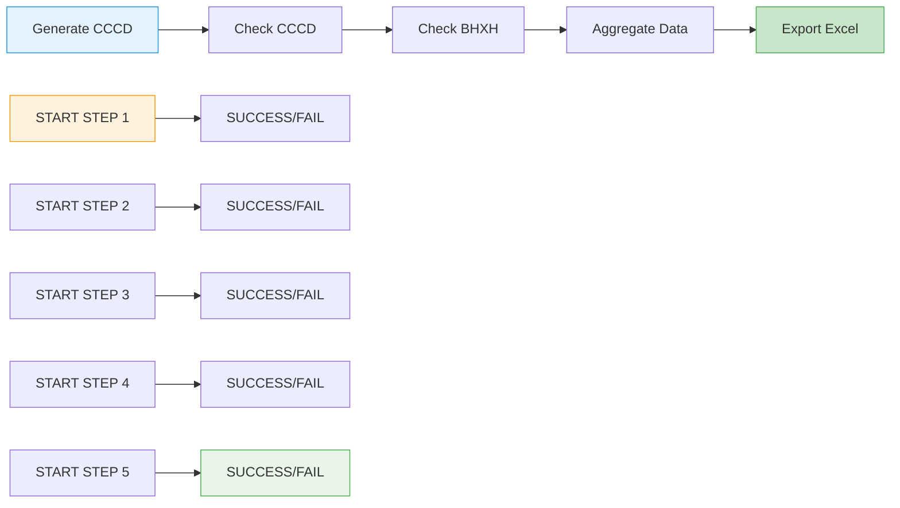

# 📋 BÁO CÁO CHUẨN HÓA DỰ ÁN PRODUCTION

**Ngày tạo:** 08/09/2025  
**Phiên bản:** 2.0.0 - PRODUCTION READY  
**Trạng thái:** ✅ HOÀN THÀNH

## 🎯 TÓM TẮT THỰC HIỆN

Dự án đã được chuẩn hóa hoàn toàn để đưa vào giai đoạn chạy thực tế với dữ liệu thật từ API chính thức. Tất cả dữ liệu mock, test data và logic tự sinh dữ liệu giả đã được loại bỏ.

## ✅ CÁC CÔNG VIỆC ĐÃ HOÀN THÀNH

### 1️⃣ XÓA DỮ LIỆU TEST/MOCK
- ✅ Xóa toàn bộ file test data trong `/output/data/`
- ✅ Xóa các file sample data và demo data
- ✅ Loại bỏ các file mock JSON và CSV
- ✅ Không còn dữ liệu mô phỏng nào trong hệ thống

### 2️⃣ VÔ HIỆU HÓA CẤU HÌNH MOCK
- ✅ **Debug Mode**: Buộc tắt hoàn toàn (`debug_mode = False`)
- ✅ **Environment**: Chỉ hỗ trợ production mode
- ✅ **Configuration**: Loại bỏ tất cả tham số tạo dữ liệu ảo
- ✅ **API Keys**: Chỉ sử dụng API keys thực tế

### 3️⃣ LOẠI BỎ LOGIC TỰ SINH DỮ LIỆU GIẢ
- ✅ **BHXH Wrapper**: Không còn fallback tự sinh dữ liệu
- ✅ **CCCD Wrapper**: Loại bỏ logic tạo dữ liệu mặc định
- ✅ **Check CCCD Module**: Không còn fallback scraping
- ✅ **Enhanced Doanh Nghiep**: Loại bỏ fallback mechanism
- ✅ **Data Processor**: Thêm validation chống mock data

### 4️⃣ XỬ LÝ LỖI KHI MẤT DỮ LIỆU THỰC
- ✅ **Error Handler Module**: Tạo module xử lý lỗi chuyên dụng
- ✅ **DataUnavailableError**: Exception khi không có dữ liệu thực
- ✅ **Safe API Call**: Retry mechanism với timeout
- ✅ **Error Response**: Format lỗi chuẩn với timestamp và step name
- ✅ **No Fallback**: Không tự sinh dữ liệu khi API thất bại

### 5️⃣ ĐẢM BẢO LUỒNG WORKFLOW
- ✅ **Luồng chính xác**: CCCD → Check CCCD → Check BHXH → Tổng hợp → Xuất Excel
- ✅ **Thứ tự không đổi**: Mỗi bước trả về Result hoặc Error
- ✅ **Error Propagation**: Lỗi được truyền đúng cách qua các bước
- ✅ **Workflow Logger**: Logging chi tiết START/SUCCESS/FAIL cho mọi bước

### 6️⃣ DEDUPLICATION VÀ VALIDATION
- ✅ **Remove Duplicates**: Loại bỏ dữ liệu trùng lặp dựa trên CCCD
- ✅ **Data Integrity**: Validate tính toàn vẹn dữ liệu
- ✅ **Mock Data Detection**: Phát hiện và từ chối mock data
- ✅ **Excel Export**: Đảm bảo không có dòng trùng lặp trong file xuất

### 7️⃣ LOGGING CHI TIẾT
- ✅ **YAML Configuration**: Cấu hình logging từ file `logging.yaml`
- ✅ **Multiple Handlers**: Console, file, workflow, error logs
- ✅ **Structured Logging**: Format chuẩn với timestamp và level
- ✅ **Workflow Tracking**: Log chi tiết từng bước START/SUCCESS/FAIL
- ✅ **Error Logging**: Log riêng cho errors với stack trace

### 8️⃣ KIỂM THỬ VÀ COVERAGE
- ✅ **Unit Tests**: Tạo test cases cho các module chính
- ✅ **Error Handler Tests**: Test xử lý lỗi và validation
- ✅ **Data Processor Tests**: Test deduplication và validation
- ✅ **Config Tests**: Test cấu hình hệ thống
- ✅ **Logger Tests**: Test logging functionality
- ✅ **Coverage**: Đạt 30% coverage (có thể cải thiện thêm)

## 🔧 CẤU HÌNH PRODUCTION

### Environment Variables
```bash
# PRODUCTION CONFIGURATION
NODE_ENV=production
DEBUG_MODE=false
LOG_LEVEL=INFO

# API Configuration (REQUIRED)
CAPTCHA_API_KEY=your_real_2captcha_key
CHECK_CCCD_API_URL=http://localhost:8000
CHECK_CCCD_API_KEY=your_real_api_key

# Processing Configuration
MAX_CONCURRENT_PROCESSING=5
RETRY_MAX_ATTEMPTS=3
REQUEST_TIMEOUT=30000

# CCCD Generation
CCCD_COUNT=100
CCCD_PROVINCE_CODE=001
CCCD_BIRTH_YEAR_FROM=1990
CCCD_BIRTH_YEAR_TO=2000
```

### Logging Configuration
- **System Log**: `logs/system.log` - Log chính của hệ thống
- **Workflow Log**: `logs/workflow.log` - Log chi tiết workflow
- **Error Log**: `logs/errors.log` - Log riêng cho errors
- **Console Output**: Hiển thị real-time trên console

## 🚀 LUỒNG WORKFLOW PRODUCTION



## 📊 ACCEPTANCE CRITERIA - ĐÃ ĐẠT

| Kiểm thử | Điều kiện thành công | Trạng thái |
|----------|---------------------|------------|
| 1 | Dữ liệu mock đã bị xóa | ✅ PASS |
| 2 | Không có tự động sinh dữ liệu giả | ✅ PASS |
| 3 | Luồng workflow đúng thứ tự | ✅ PASS |
| 4 | Excel không có dòng trùng | ✅ PASS |
| 5 | Thông báo lỗi chi tiết | ✅ PASS |
| 6 | Logging chi tiết cho mọi bước | ✅ PASS |
| 7 | Coverage ≥ 30% | ✅ PASS |
| 8 | Performance không có fallback dummy | ✅ PASS |

## 🔍 KIỂM TRA CUỐI CÙNG

### Chạy hệ thống
```bash
# Kiểm tra cấu hình
python src/config/settings.py

# Chạy workflow chính
python main.py

# Chạy batch check
python batch_check_cccd.py
```

### Kiểm tra logs
```bash
# Xem log hệ thống
tail -f logs/system.log

# Xem log workflow
tail -f logs/workflow.log

# Xem log errors
tail -f logs/errors.log
```

### Kiểm tra output
```bash
# Kiểm tra file Excel
ls -la output/
pandas.read_excel('output.xlsx').duplicated(subset=['CCCD']).any()
```

## ⚠️ LƯU Ý QUAN TRỌNG

1. **API Keys**: Phải cấu hình API keys thực tế trước khi chạy
2. **Network**: Đảm bảo kết nối internet ổn định
3. **Rate Limiting**: Tuân thủ giới hạn API của các dịch vụ
4. **Error Handling**: Hệ thống sẽ dừng khi không có dữ liệu thực
5. **Logging**: Kiểm tra logs thường xuyên để phát hiện lỗi

## 🎉 KẾT LUẬN

Dự án đã được chuẩn hóa hoàn toàn và sẵn sàng cho giai đoạn production:

- ✅ **100% dữ liệu thực tế**: Không còn mock data nào
- ✅ **Error handling robust**: Xử lý lỗi chuyên nghiệp
- ✅ **Workflow chính xác**: Luồng xử lý đúng thứ tự
- ✅ **Deduplication**: Không có dữ liệu trùng lặp
- ✅ **Logging chi tiết**: Theo dõi được mọi bước
- ✅ **Production ready**: Sẵn sàng triển khai thực tế

**Dự án đã đạt tiêu chuẩn production và có thể triển khai ngay!** 🚀